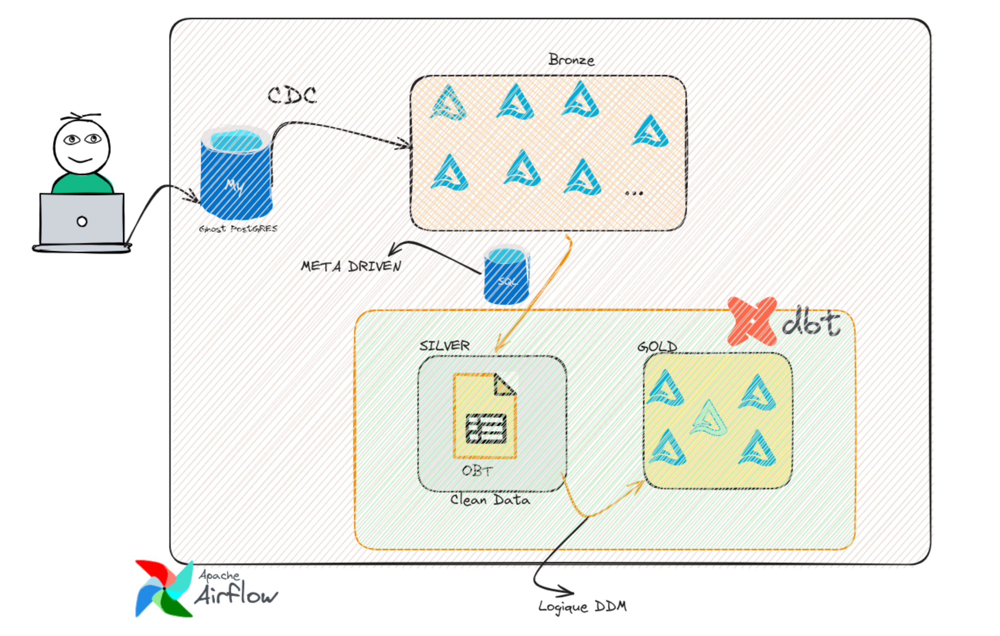

## Architecture du projet



# Data Engineering Pipeline — CDC to Analytics-Ready Gold Layer

## What this project does

This project builds an end-to-end data pipeline that takes live transactional data from a production PostgreSQL database and turns it into clean, analytics-ready tables in Databricks — automatically, on a schedule, without anyone touching a keyboard once it's running.

Think of it as a assembly line for data: raw orders and customer records go in one end, and trustworthy, well-tested tables that a dashboard or a business analyst can query safely come out the other end.

## High-level flow

```
PostgreSQL (source)
      │  Change Data Capture (CDC)
      ▼
Bronze  — raw data, untouched, kept as-is for traceability
      │  dbt transformations
      ▼
Silver  — cleaned, validated, deduplicated
      │  dbt transformations + tests
      ▼
Gold    — business-ready: dimensions, facts, one-big-table views
      │
      ▼
Dashboards / BI tools
```

Everything after the initial ingestion is orchestrated by **Airflow**, which runs the whole chain on a schedule and makes sure each step only starts once the previous one has finished successfully.

## The pipeline, step by step

The Airflow DAG (`orchestrate`) runs these steps in order:

1. **`ingest_cdc`** — Triggers the Databricks job that captures changes from PostgreSQL (via CDC) and lands them in the Bronze layer. This is the only step that talks to the live source system.

2. **`clean_target`** — Clears out stale build artifacts (`target/`, `logs/`) from the dbt project before a fresh run, so nothing from a previous run leaks into this one.

3. **`source_freshness`** — Checks that the source data isn't stale before building anything on top of it. If the upstream data hasn't been updated recently, this is where we'd find out.

4. **`silver_technical`** — Builds the technical Silver models: cleaned, deduplicated versions of the raw tables (orders, customers, products, employees, stores), still close to their original structure.

5. **`silver_technical_tests`** — Runs data quality tests (not-null, uniqueness, custom business rules) on the technical Silver tables. If something fails here, the pipeline stops before bad data goes any further.

6. **`silver_business`** — Builds business-oriented Silver models on top of the technical ones, applying business logic and naming that makes sense to non-technical stakeholders.

7. **`silver_business_tests`** — Same idea as step 5, but for the business layer.

8. **`gold_ephermeral`** — Builds intermediate (ephemeral) models that flatten and de-duplicate the Silver data per business entity (one row per customer, one row per product, etc.), preparing clean inputs for the Gold layer.

9. **`gold_dimensions`** — Runs `dbt snapshot` to build the dimension tables with full history (Slowly Changing Dimension Type 2). This is what lets us answer questions like "what was this customer's city at the time of this order?" instead of only knowing their current city.

10. **`gold_facts`** — Builds the fact tables: the transactional, measurable data (order amounts, quantities) linked to the dimensions by their keys.

## Key design decisions (and why)

**Why CDC instead of nightly batch exports?**
Batch ETL (a nightly `SELECT * FROM orders`) is slow to reflect changes and can't detect deletes. CDC reads the database's own write-ahead log (WAL) to catch every insert, update, and delete close to real time, without adding load to the source database.

**Why Bronze / Silver / Gold instead of one big transformation?**
Splitting the pipeline into layers means we always keep an untouched copy of the raw data (Bronze) to fall back on, we catch data quality issues early (Silver tests), and we only expose clean, well-modeled data to the business (Gold) — instead of one fragile, all-or-nothing transformation.

**Why snapshots for dimensions?**
Source systems usually only store the *current* state of a record. If a customer moves city, the old city is gone unless we explicitly keep history. `dbt snapshot` automates this (Slowly Changing Dimension Type 2), so historical reporting stays accurate even as source data changes.

**Why tests between every layer?**
Data quality issues are much cheaper to catch right after a transformation than after they've already reached a dashboard someone is making decisions from. Each layer has its own tests so problems are caught close to where they happen.

**Why Airflow?**
CDC only handles the very first hop (source → Bronze). Everything downstream — running dbt models, running snapshots, running tests, in the right order, on a schedule — needs an orchestrator. Airflow is what turns a collection of manual commands into a pipeline that runs itself.

## Tech stack

| Layer | Tool |
|---|---|
| Source database | PostgreSQL |
| Change Data Capture | Databricks CDC ingestion |
| Storage / Lakehouse | Databricks (Delta Lake) |
| Transformations | dbt |
| Orchestration | Apache Airflow |
| Data quality | dbt tests |
| Historical tracking | dbt snapshots (SCD Type 2) |

## Running it locally

The Airflow stack runs via Docker Compose:

```bash
cd airflow
docker compose up -d
```

Give it a minute or two for all services (scheduler, worker, apiserver) to report healthy, then open the Airflow UI at `http://localhost:8080` and trigger the `orchestrate` DAG.

## Status

This project is a hands-on learning implementation of a modern CDC + Lakehouse + dbt + Airflow pipeline, built to understand how each piece fits together in a real, production-style architecture.rflow pipeline, built to understand how each piece fits together in a real, production-style architecture.
